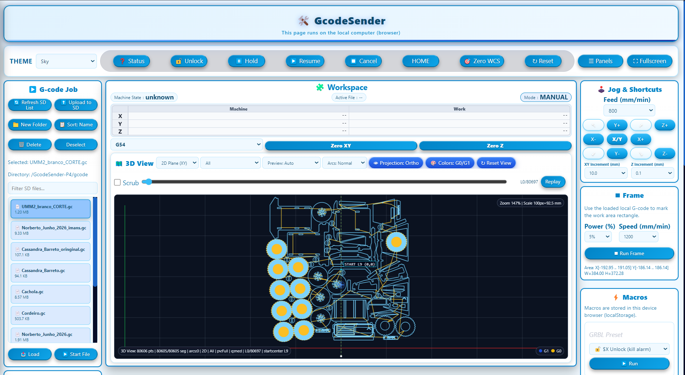

# GcodeSender

**G-code sender firmware for ESP32-P4** — part of the [Node32-HUB](https://github.com/nasp2000/Node32-HUB) project.

Streams G-code to GRBL-based CNC controllers via **USB Host**, with a web-based control panel that runs entirely in the browser — zero server load, the ESP32 only sends raw data. Features automatic error recovery, dual storage (SD card + PSRAM), and a fully customisable drag-and-drop interface.

📷 [More screenshots](image/)

---

## Features

### Storage
- **SD card** — primary storage. Upload files via the web UI or copy directly to the card. The sender streams directly from SD.
- **PSRAM** — fallback when no SD card is present. Upload files via the web UI to the board's built-in PSRAM. Contents are lost on reboot.
- **Hybrid mode** — when both are available, the file is loaded into PSRAM for faster streaming. If the file is too large, the remainder is fetched incrementally from SD.

### Transport
- **USB Host** — connect directly to a GRBL controller via USB (ESP32-P4 native OTG).

### Web UI (`/grbl-controller`)
The control panel runs entirely in the browser — all rendering, data processing, and preview calculations are done locally. The ESP32 only sends raw data; the page never reloads.

- **Drag-and-drop widgets** — rearrange the layout freely by dragging any widget. Each widget remembers its position.
- Machine position display (DRO) with real-time updates
- Start, pause, resume, cancel, feed hold, reset, unlock, home
- Browse and stream G-code files from SD card
- Upload files to SD card or to PSRAM (no SD needed)
- Text area for quick commands (local queue)
- Real-time console log with status feedback
- Event log for alarms, errors, and state changes
- Multi-session support (one operator, multiple observers)
- USB diagnostics and auto-baud detection

### Reliability
- Automatic retry on errors, alarm auto-clear (`$X`), and stall detection
- G-code preprocessing — removes comments and blank lines before sending
- Job logging to SD card for debugging
- Adaptive polling — adjusts to command throughput automatically

---

## Hardware Recommendation

[**Waveshare ESP32-P4 Module Dev Kit**](https://www.waveshare.com/esp32-p4-module-dev-kit.htm)

The only tested board. Built-in USB Host OTG (for GRBL connection), SD card slot, PSRAM, and Ethernet — everything required.

---

## Quick start

1. Flash the pre-built binary to your ESP32-P4 (binaries in Releases)
2. Connect the GRBL controller to **USB port 0** ⚠️ only port 0 works, the others are ignored
3. Open `http://<esp32-ip>/grbl-controller` in a browser
4. Click **Auto-detect baud** — the sender will find the right rate automatically

---

## License

Same as Node32-HUB — see the [main repository](https://github.com/nasp2000/Node32-HUB).
