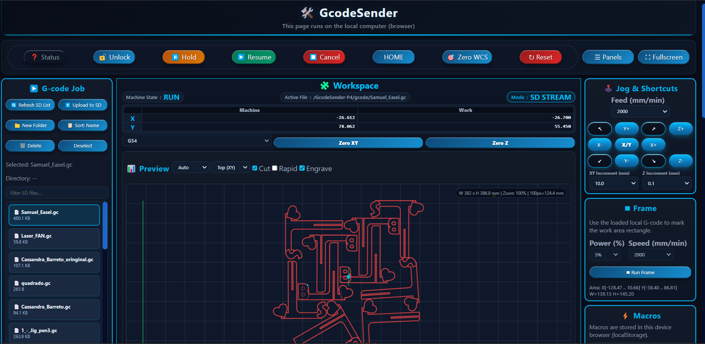
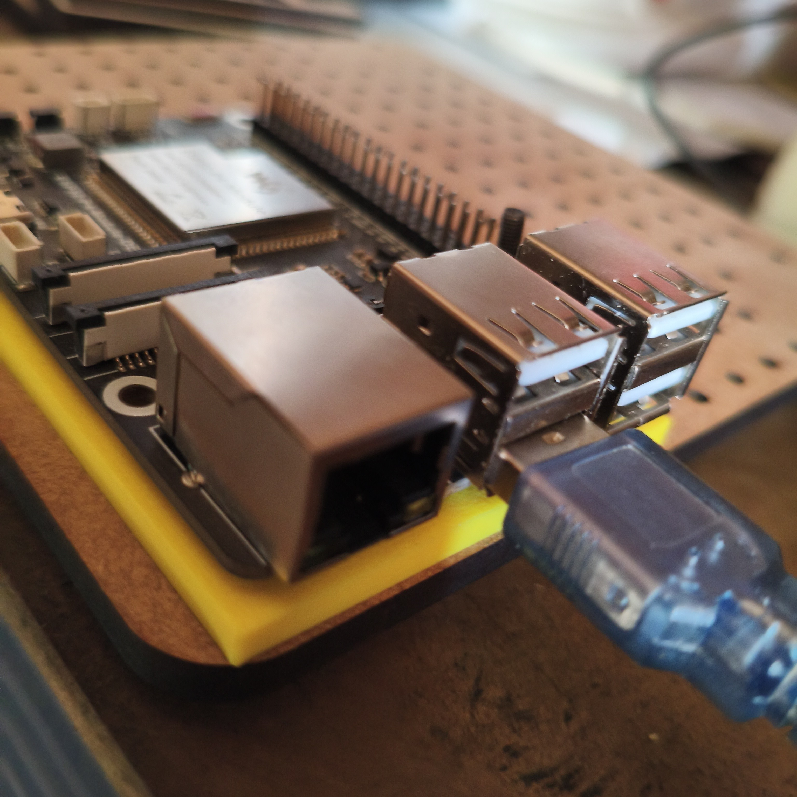

# GcodeSender

**G-code sender firmware for ESP32-P4** — part of the [Node32-HUB](https://github.com/nasp2000/Node32-HUB) project.

> ⚠️ Current release targets **ESP32-P4 only**.

Streams G-code to GRBL-based CNC controllers and **diode lasers** via **USB Host**, with a web-based control panel that runs entirely in the browser — zero server load, the ESP32 only sends raw data. Features automatic error recovery, dual storage (SD card + PSRAM), and a customisable dock layout.

📷 [More screenshots](image/)

---

## Features

### Storage
- **SD card** — primary storage. Upload files via the web UI or copy directly to the card. The sender streams directly from SD.
- **PSRAM** — fallback when no SD card is present. Upload files via the web UI to the board's built-in PSRAM. Contents are lost on reboot.
- **Hybrid mode** — when both are available, the file is loaded into PSRAM for faster streaming. If the file is too large, the remainder is fetched incrementally from SD.

### Transport
- **USB Host** — connect directly to a GRBL controller via USB (ESP32-P4 native OTG).

### Web UI (`/grbl-controller`)
The control panel runs entirely in the browser — all rendering, data processing, and preview calculations are done locally. The ESP32 only sends raw data; the page never reloads.

- Customisable dock layout — show/hide, reorder and move widgets between docks (each widget remembers its position)
- Machine position display (DRO) with real-time updates
- Start, pause, resume, cancel, feed hold, reset, unlock, home
- Browse and stream G-code files from SD card
- Upload files to SD card or to PSRAM (no SD needed)
- Text area for quick commands (local queue)
- Real-time console log with status feedback
- Event log for alarms, errors, and state changes
- 2D path preview with real-time job progress — shows the already-cut path vs. what remains while streaming
- Feed and spindle/laser overrides applied live on demand, without interrupting the stream
- Height-map compensation from a probed Z grid for uneven surfaces
- Contour (piece) selection in the preview - click near lines, Tab=next, Space=toggle, skip disabled contours on the next run
- Multi-session support (one operator, multiple observers)
- USB diagnostics and auto-baud detection

### Reliability
- Automatic retry on errors, alarm auto-clear (`$X`), and stall detection
- G-code preprocessing — removes comments and blank lines before sending
- Staged + PSRAM streaming with automatic fallback and per-line error recovery
- Job logging to SD card for debugging
- Adaptive polling — adjusts to command throughput automatically

---

## Hardware Recommendation

[**Waveshare ESP32-P4 Module Dev Kit**](https://www.waveshare.com/esp32-p4-module-dev-kit.htm)

The only tested board. Built-in USB Host OTG (for GRBL connection), SD card slot, PSRAM, and Ethernet — everything required.

---

## Quick start

1. Flash the pre-built binary to your ESP32-P4 (binaries in Releases) using [webflasher_Node32-HUB](https://github.com/nasp2000/webflasher_Node32-HUB). For future updates use **OTA** at `http://<esp32-ip>/ota`
2. Connect the GRBL controller to **USB port 0** ⚠️ only port 0 works, the others are ignored

   

3. Open `http://gcodesender-p4.local/grbl-controller` in a browser (mDNS) or `http://<esp32-ip>/grbl-controller`
4. Click **Auto-detect baud** — the sender will find the right rate automatically

---

## First Access

1. Flash the pre-built binary
2. Wait for AP **NODE32-HUB**
3. Connect with password **12345678**
4. Browse to `http://192.168.4.1`
5. Login with user **root** / password **root**
6. Go to **Settings → Wi-Fi** and connect to your local network
7. Once connected, the AP turns off automatically and the device is reachable at `http://gcodesender-p4.local` (mDNS) or the assigned IP

> If the device loses connection to the Wi-Fi network, it reactivates AP mode automatically.

---

## License

Released under the MIT License — see [LICENSE](https://github.com/nasp2000/Node32-HUB/blob/main/LICENSE) in the main repository. This firmware links LGPL-2.1/LGPL-3.0 libraries; see [THIRD_PARTY_NOTICES](https://github.com/nasp2000/Node32-HUB/blob/main/THIRD_PARTY_NOTICES).
